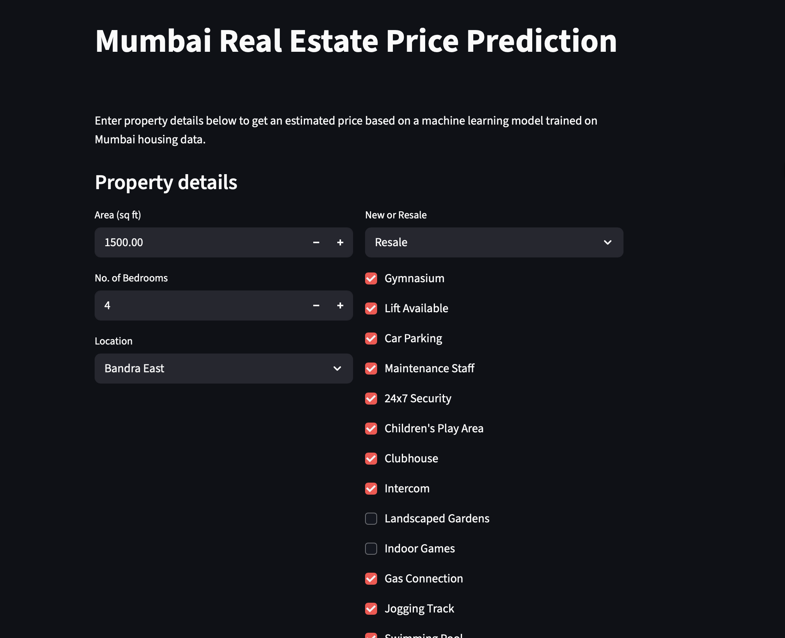
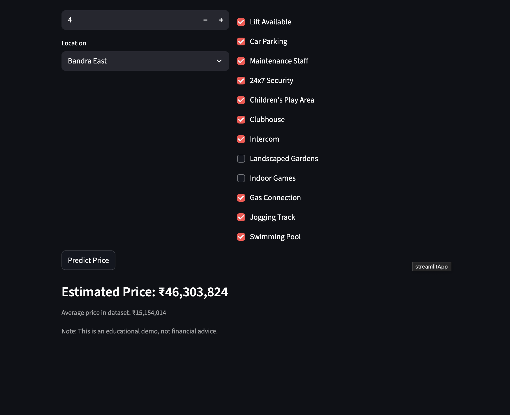

# 🏙️ Mumbai Real Estate Price Predictor 

[](https://realestatepricepredictormumbai.streamlit.app)

An interactive machine learning web application that predicts housing prices across Mumbai based on property characteristics such as area, locality, amenities, and property condition.
---

## 🚀 Live Demo
https://realestatepricepredictormumbai.streamlit.app

---

## 📸 App Previews

| Home UI | Price Output |
|--------|--------------|
|  |  |

---

## 🎯 Key Features

| Feature | Description |
|--------|-------------|
| Automated ML Pipeline | Preprocessing, feature encoding, and model training |
| Live Deployment | Real-time inference via Streamlit UI |
| Location Intelligence | Captures value differences across Mumbai neighborhoods |
| Configurable Property Features | Bedrooms, area, amenities, property type |
| Cloud-Safe Execution | Retrains in cloud to ensure compatibility |

---

## 🧠 Model Workflow

User Input → Feature Engineering → RandomForestRegressor → Price Prediction → UI Rendering

The serialized trained pipeline is version-controlled for reproducibility and efficient loading.

---

## 📊 Performance

| Metric | Value |
|--------|-------|
| R² Score | 0.60+ |

_(Performance derived using cleaned Mumbai housing dataset)_

---

## 🛠️ Tech Stack

| Layer | Technology |
|------|------------|
| Machine Learning | Python, Scikit-Learn, Pandas |
| Web UI | Streamlit |
| Model Persistence | Joblib |
| Deployment | Streamlit Cloud |
| Version Control | Git + GitHub |

---

## 📁 Repository Structure

```bash
Real-Estate-price-prediction/
│
├── app.py                # Streamlit UI & inference logic
├── model_training.py     # Training + model persistence
├── requirements.txt      # Python dependencies
├── models/               # Serialized model artifacts (auto-created)
├── notebooks/            # Dataset & experiments
├── Mumbai1.csv           # Source dataset (excluded in deployment)
└── assets/               # UI screenshots for README (add your images here)


